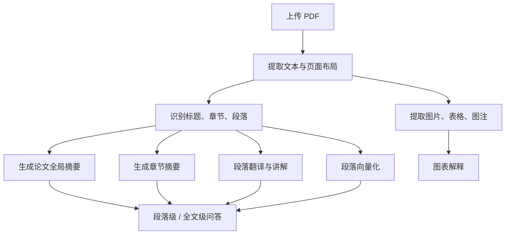

# 论文阅读助手设计规划

## 1. 产品定位

这是一个面向论文精读的 Web 应用或桌面应用。用户上传论文 PDF，并提供自己的 AI API Key 后，系统将论文解析成结构化内容，按章节、段落、图表组织展示。每个段落保留原文，同时提供忠实翻译、内容讲解，以及面向该段落的追问入口。

核心目标不是简单翻译论文，而是帮助用户完成“读懂论文”的完整过程：

- 快速把 PDF 转成可阅读、可检索、可对话的结构化论文。
- 对每段内容提供原文、翻译、解释三层信息。
- 让用户能围绕某一段、某张图、某个公式继续追问。
- 回答时既理解当前段落，也能结合整篇论文上下文。

## 2. 目标用户

主要用户：

- 需要阅读英文论文的学生、研究者、工程师。
- 想快速理解论文贡献、方法、实验和结论的人。
- 希望保留原文语境，而不是只看机器翻译的人。

典型使用场景：

- 精读一篇新论文。
- 复现论文前理解方法细节。
- 写文献综述时整理论文结构和核心观点。
- 阅读跨领域论文时补足背景解释。

## 3. 核心体验

### 3.1 上传与配置

用户第一次进入应用时，需要完成两件事：

1. 上传论文 PDF。
2. 填入 API Key，并选择模型供应商。

建议支持的模型配置：

- OpenAI compatible endpoint。
- API Key。
- 模型名称。
- 可选 base URL。

API Key 应优先只保存在本地浏览器或本地应用环境中，不上传到项目自己的服务器，除非用户明确选择云端同步。

### 3.2 论文结构化阅读

PDF 解析完成后，应用进入阅读界面。

主阅读区按论文结构展示：

- 标题、作者、摘要。
- Introduction。
- Related Work。
- Method。
- Experiment。
- Results。
- Discussion。
- Conclusion。
- References。

系统不应强依赖固定章节名，而应通过 PDF 文本结构和标题层级推断模块。

每个模块下面继续按段落展示。每个段落卡片包含：

- 原文。
- 忠实翻译。
- 分析讲解。
- 段落级 AI 对话框。

段落讲解可以包括：

- 这段在论文中的作用。
- 关键术语解释。
- 作者在这里想证明或铺垫什么。
- 与前后文的关系。
- 可能的隐含假设或阅读难点。

### 3.3 段落级追问

每个段落下面有一个小型对话入口。

用户提问时，系统应把以下上下文传给模型：

- 当前段落原文。
- 当前段落翻译和讲解。
- 当前章节摘要。
- 整篇论文的全局摘要。
- 必要时检索出的相关段落。

回答风格应优先面向阅读理解，而不是泛泛聊天：

- 先回答用户问题。
- 引用当前段落或相关段落的依据。
- 如果论文没有给出答案，要明确说明“论文中没有直接说明”。

### 3.4 图表理解

系统需要识别 PDF 中的图片、表格和图注。

每个图表区域展示：

- 原图截图。
- 图题或表题。
- AI 解释。
- 与正文中相关段落的链接。
- 图表级追问入口。

图表讲解重点：

- 图里展示的变量或指标是什么。
- 坐标轴、图例、颜色或表格列分别代表什么。
- 作者想通过这张图证明什么。
- 图表结论是否支持论文主张。

## 4. MVP 范围

第一版建议先做“单用户、本地优先、单篇论文精读”。

必须有：

- PDF 上传。
- PDF 文本提取。
- 自动按章节和段落切分。
- 原文展示。
- 段落翻译。
- 段落讲解。
- 段落级问答。
- 用户提供 API Key。
- 处理进度展示。

可以延后：

- 用户账号系统。
- 云端论文库。
- 多论文知识库。
- 协作批注。
- 引文网络分析。
- 自动生成综述。
- 移动端深度适配。
- 复杂公式识别。

图表识别可以放进 MVP 的弱版本：

- 先提取 PDF 页面截图和图片区域。
- 优先结合图注解释。
- 不要求第一版做到精准视觉理解每个细节。

## 5. 页面与信息架构

### 5.1 首页 / 工作台

功能：

- 上传 PDF。
- 配置 API。
- 展示最近打开的论文。

第一版可以直接以“上传论文”为主，不做营销页。

### 5.2 解析进度页

展示处理流程：

1. 读取 PDF。
2. 提取文本。
3. 识别章节。
4. 切分段落。
5. 生成摘要。
6. 生成段落翻译与讲解。
7. 提取图表。

需要支持失败重试，尤其是 AI 调用失败、PDF 解析失败和 API Key 无效。

### 5.3 阅读页

推荐三栏布局：

- 左侧：论文目录、搜索、处理状态。
- 中间：原文、翻译、讲解、图表。
- 右侧：全局 AI 助手、笔记、术语表。

窄屏时可以切换为：

- 顶部目录按钮。
- 中间单栏阅读。
- 右侧助手变成抽屉。

阅读页核心组件：

- `PaperOutline`：论文目录。
- `SectionBlock`：章节块。
- `ParagraphBlock`：段落阅读块。
- `FigureBlock`：图表块。
- `InlineChatBox`：段落级对话。
- `GlobalChatPanel`：整篇论文对话。
- `TermGlossary`：术语解释。

## 6. 系统架构

建议采用前后端分离，但第一版可以用全栈框架简化开发。

推荐技术路线：

- 前端：Next.js / React。
- UI：Tailwind CSS 或 shadcn/ui。
- PDF 解析：`pdfjs-dist` 负责前端预览，后端可用 `pdf-parse`、`PyMuPDF` 或 `unstructured` 做文本和图片提取。
- 后端：Next.js API routes、FastAPI 或 Node.js 服务。
- 存储：本地开发用 SQLite，后续可迁移 PostgreSQL。
- 向量检索：本地可先用 SQLite + 向量扩展，或轻量向量库；后续换 Qdrant / pgvector。
- AI 调用：OpenAI compatible client，抽象成 provider 层。

### 6.1 模块划分

核心模块：

- PDF Intake：上传、校验、文件存储。
- PDF Parser：文本、章节、段落、图片、图注提取。
- Paper Structurer：论文结构推断。
- AI Processor：摘要、翻译、讲解、图表解释。
- Embedding / Retrieval：段落向量化和相关上下文召回。
- Chat Engine：段落级与全文级问答。
- Reader UI：阅读、目录、对话、笔记。
- API Settings：模型供应商和 API Key 管理。

### 6.2 处理流水线



## 7. 数据模型

核心实体：

### 7.1 Paper

- `id`
- `title`
- `authors`
- `abstract`
- `pdfFilePath`
- `status`
- `createdAt`
- `updatedAt`

### 7.2 Section

- `id`
- `paperId`
- `title`
- `level`
- `order`
- `summary`

### 7.3 Paragraph

- `id`
- `paperId`
- `sectionId`
- `order`
- `pageNumber`
- `sourceText`
- `translation`
- `explanation`
- `embedding`

### 7.4 Figure

- `id`
- `paperId`
- `sectionId`
- `pageNumber`
- `imagePath`
- `caption`
- `explanation`
- `relatedParagraphIds`

### 7.5 ChatMessage

- `id`
- `paperId`
- `scopeType`
- `scopeId`
- `role`
- `content`
- `createdAt`

`scopeType` 可以是：

- `paper`
- `section`
- `paragraph`
- `figure`

## 8. API 设计

第一版可设计这些接口：

- `POST /api/papers/upload`：上传 PDF。
- `GET /api/papers`：获取论文列表。
- `GET /api/papers/:paperId`：获取论文基础信息。
- `GET /api/papers/:paperId/structure`：获取章节、段落、图表结构。
- `POST /api/papers/:paperId/process`：启动解析与 AI 处理。
- `GET /api/papers/:paperId/jobs/:jobId`：查询处理进度。
- `POST /api/chat`：段落级或全文级问答。
- `POST /api/settings/model`：保存模型配置。

`POST /api/chat` 请求示例：

```json
{
  "paperId": "paper_123",
  "scopeType": "paragraph",
  "scopeId": "paragraph_456",
  "message": "这段里的 ablation study 是什么意思？"
}
```

## 9. AI 提示词策略

### 9.1 段落翻译

目标：

- 忠于原文。
- 不随意扩写。
- 保留关键术语。
- 必要时在括号中保留英文术语。

输出：

- 中文翻译。

### 9.2 段落讲解

目标：

- 用中文解释这段在论文中的作用。
- 提取关键概念。
- 指出和论文主问题的关系。
- 降低阅读门槛。

输出结构：

- 核心意思。
- 关键术语。
- 为什么这段重要。
- 阅读提示。

### 9.3 段落问答

上下文优先级：

1. 当前段落。
2. 当前章节摘要。
3. 检索出的相关段落。
4. 全文摘要。

回答原则：

- 不编造论文没有的信息。
- 能引用原文依据时引用简短片段。
- 对不确定内容做明确标注。

## 10. 隐私与安全

关键原则：

- API Key 默认只保存在本地。
- 不记录用户 API Key 明文到日志。
- 上传 PDF 需要限制大小和类型。
- 如果支持云端部署，要明确提示 PDF 与模型供应商之间的数据流向。
- 对 AI 失败、限流、余额不足等状态提供清晰提示。

## 11. 主要技术风险

### 11.1 PDF 结构混乱

论文 PDF 经常存在双栏、跨页、公式、脚注、参考文献等问题。

应对：

- 第一版优先支持常规机器学习 / 计算机论文格式。
- 保留页面号和原始文本位置，方便纠错。
- 章节识别失败时允许用户手动调整。

### 11.2 AI 调用成本高

逐段翻译和讲解会消耗大量 tokens。

应对：

- 分阶段处理：先摘要和目录，再按需生成段落讲解。
- 缓存每段的 AI 输出。
- 支持用户选择“快速模式”和“精读模式”。

### 11.3 图表理解难度高

PDF 图片、表格和图注的对应关系可能不稳定。

应对：

- 第一版优先依赖图注和邻近正文。
- 图片视觉识别作为增强能力。
- 对低置信结果标记“可能不完整”。

### 11.4 上下文过长

整篇论文无法直接塞进一次对话上下文。

应对：

- 使用全文摘要、章节摘要、段落检索组合。
- 聊天时基于 scope 做 RAG。
- 对长论文采用分块摘要。

## 12. 迭代路线

### V0.1 原型

- 上传 PDF。
- 提取文本。
- 手动或半自动按段落展示。
- 用户填写 API Key。
- 对选中段落生成翻译和讲解。

### V0.2 MVP

- 自动章节识别。
- 整篇论文处理进度。
- 段落级问答。
- 全文摘要。
- 基础缓存。

### V0.3 精读体验

- 图表提取与解释。
- 术语表。
- 右侧全局助手。
- 搜索和目录跳转。
- 处理失败重试。

### V0.4 研究工作流

- 多篇论文管理。
- 阅读笔记。
- 导出 Markdown。
- 论文间对比。
- 文献综述辅助。

## 13. 第一周开发建议

第一周不要急着做完整 AI 阅读器。建议先完成一条最小闭环：

1. 搭建应用骨架。
2. 实现 PDF 上传。
3. 提取 PDF 文本。
4. 把文本切成段落。
5. 展示原文段落列表。
6. 对单个段落调用模型生成翻译和讲解。
7. 在段落下方支持一次追问。

只要这条闭环跑通，后续章节识别、全文摘要、图表解释、向量检索都可以渐进加入。

## 14. 推荐的下一步

下一步可以进入技术选型和项目初始化。推荐先明确两个问题：

- 应用形态：纯网页、Electron 桌面应用，还是本地 Web 应用。
- 模型调用方式：只支持 OpenAI compatible，还是一开始就做多供应商配置。

如果目标是最快做出可用版本，建议：

- 使用 Next.js 做全栈应用。
- 使用 SQLite 做本地数据存储。
- 使用 `pdfjs-dist` 做 PDF 预览。
- 使用后端 API 负责 PDF 解析和 AI 调用。
- 先做 OpenAI compatible provider 抽象，避免后续被单一模型供应商绑定。
